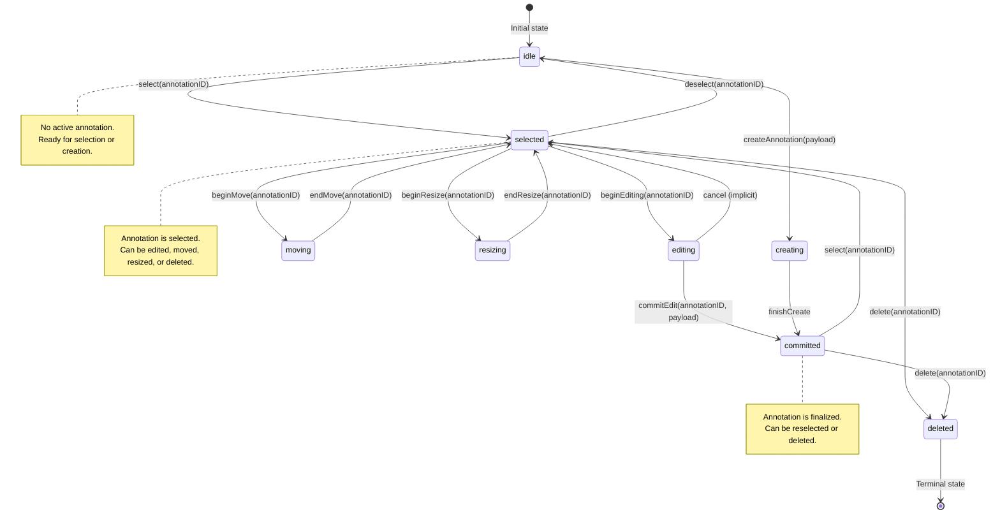
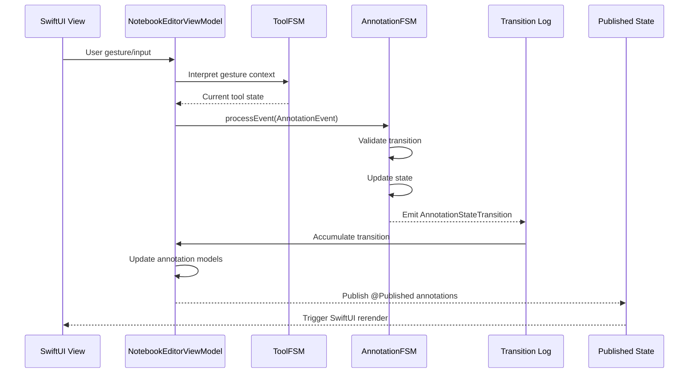

# DocumentApp: Research Document Annotation Platform

## Overview

DocumentApp is a macOS and iOS application designed for research-oriented document annotation and analysis. The platform provides a sophisticated document editing environment with persistent state management, deterministic binary serialization, and event-driven annotation workflows.

## Architecture

### Core Technologies

**BlazeBinary Serialization**
- Deterministic binary encoding for document persistence
- Type-Length-Value (TLV) format with field order preservation
- Zero-copy decoding where possible
- Schema evolution support for forward compatibility

**BlazeFSM State Management**
- Event-driven finite state machines for annotation workflows
- Transition-based state persistence
- Ephemeral tool state management
- Replay-based state reconstruction

**SwiftUI Document Architecture**
- Native FileDocument protocol integration
- Custom Uniform Type Identifier (UTI) for notebook documents
- Automatic save/load coordination with state machines

### Document Format

Notebook documents (`.blaze-note`) store:

1. **Metadata**
   - Document title
   - Creation timestamp (UInt64 epoch seconds)
   - Last modification timestamp

2. **Annotation State Transitions**
   - Complete history of annotation state changes
   - Event-driven transition records
   - Replayable state reconstruction

3. **Editor Tool State**
   - Current tool selection
   - Tool-specific context

### State Machine Architecture

**AnnotationFSM**
- Manages annotation lifecycle states (idle, selected, editing, moving, resizing, creating, committed, deleted)
- Validates state transitions
- Emits transition records for persistence
- Supports multiple annotation instances

**ToolFSM**
- Manages editor tool selection (idle, selection, pen, pencil, highlighter, text, arrow, eraser, lasso)
- Ephemeral state (not persisted)
- Influences annotation event dispatch

### Annotation State Machine

The annotation lifecycle is governed by a finite state machine that ensures valid state transitions and prevents invalid annotation operations. All transitions are validated and recorded for persistence.



**State Transition Rules:**
- **idle**: Initial state with no active annotation
- **selected**: Annotation is selected and ready for operations
- **editing**: Annotation content is being modified
- **moving**: Annotation position is being changed
- **resizing**: Annotation dimensions are being adjusted
- **creating**: New annotation is being created
- **committed**: Annotation is finalized and persisted
- **deleted**: Annotation is marked for removal (terminal state)

## Features

### Document Management
- Create new annotation notebooks
- Open existing notebooks
- Save with automatic timestamp updates
- Binary format for efficient storage

### Annotation System
- Multiple annotation types supported
- State-based annotation lifecycle management
- Transition history for undo/redo capabilities
- Event-driven annotation workflows

### Serialization
- Deterministic binary encoding
- Field order preservation
- Schema evolution support
- Efficient storage format

## Technical Specifications

### Binary File Format (BlazeBinary Layout)

The notebook document format uses deterministic sequential encoding with strict field ordering. This ensures cross-platform stability, forward compatibility, and reproducible file output.



```mermaid
flowchart LR
    A["Magic Bytes<br/>'BNBK'<br/>(4 bytes)"] --> B["Version<br/>UInt8<br/>(1 byte)"]
    B --> C["Metadata Block"]
    C --> D["Title<br/>String<br/>(varint length + UTF-8)"]
    D --> E["CreatedAt<br/>UInt64<br/>(8 bytes, epoch seconds)"]
    E --> F["UpdatedAt<br/>UInt64<br/>(8 bytes, epoch seconds)"]
    F --> G["Transition Count<br/>Varint<br/>(LEB128)"]
    G --> H["Transition Stream<br/>AnnotationStateTransition[]"]
    H --> I["Initial Tool State<br/>EditorToolState<br/>(String rawValue)"]
    
    style A fill:#e1f5ff
    style B fill:#e1f5ff
    style C fill:#fff4e1
    style D fill:#fff4e1
    style E fill:#fff4e1
    style F fill:#fff4e1
    style G fill:#e8f5e9
    style H fill:#e8f5e9
    style I fill:#f3e5f5
```

**Format Characteristics:**
- **Deterministic Order**: Fields are encoded in strict sequential order (metadata → transitions → tool state)
- **Forward Compatibility**: Version field enables format evolution without breaking existing documents
- **Sequential BlazeBinary Encoding**: All fields use BlazeBinary's deterministic encoding rules
- **Cross-Platform Stability**: Little-endian integers and UTF-8 strings ensure consistent behavior across architectures

### File Format

**NotebookDocument Format**
- Magic identifier: Custom UTI `com.danylchuk.notebook.bnbk`
- Encoding: BlazeBinary (deterministic binary)
- Field order: metadata, transitions array, initial tool state
- Version: Format version 1

**Encoding Rules**
- Strings: UTF-8 with varint length prefix
- Integers: Little-endian fixed-width (UInt32, UInt64) or varint (Int)
- Floating point: Double bit pattern as UInt64
- Arrays: Varint count prefix followed by elements
- Optionals: Boolean flag followed by value if present

### Notebook Editor Data Flow

The editor architecture follows an event-driven pipeline that mirrors high-end document editing applications (Figma, Notability, Adobe Acrobat). User gestures are interpreted by tool state machines, converted to annotation events, processed through annotation state machines, and result in state transitions that drive UI updates.



**Architecture Notes:**
- **Event-Driven Pipeline**: All user interactions flow through state machines as events
- **Transition Logging**: Every state change is recorded for persistence and undo/redo
- **Reactive Updates**: SwiftUI automatically rerenders when published state changes
- **Separation of Concerns**: Tool selection (ephemeral) is separate from annotation state (persistent)

### State Machine Integration

**Transition Replay**
1. Load document transitions from binary format
2. Initialize AnnotationFSM instances
3. Replay transitions in chronological order
4. Reconstruct annotation states

**State Persistence**
1. Capture transitions via AnnotationFSM callbacks
2. Accumulate transitions during editing session
3. Encode transitions array on document save
4. Store current tool state for restoration

## Development

### Requirements
- macOS 15.7+ or iOS 15.7+
- Xcode 15.0+
- Swift 5.0+
- BlazeBinary package dependency
- BlazeFSM package dependency

### Building

```bash
# Open in Xcode
open DocumentApp.xcodeproj

# Or build from command line
xcodebuild -project DocumentApp.xcodeproj -scheme DocumentApp -destination 'platform=macOS' build
```

### Project Structure

```
DocumentApp/
├── NotebookDocument/
│   ├── NotebookMetadata.swift          # Document metadata structure
│   ├── NotebookFileData.swift          # Complete file format
│   ├── BlazeBinaryNotebookCoder.swift  # Encoding/decoding utilities
│   ├── NotebookDocument.swift           # FileDocument implementation
│   ├── NotebookEditorViewModel.swift    # State management view model
│   ├── NotebookEditorView.swift        # Editor UI
│   ├── BlazeFSM+BlazeBinary.swift      # Protocol conformance extensions
│   └── UTType+NotebookDocument.swift    # File type registration
├── ContentView.swift                    # Main application view
└── DocumentAppApp.swift                 # Application entry point
```

### Dependencies

**BlazeBinary**
- Deterministic binary serialization framework
- Provides BlazeBinaryEncoder and BlazeBinaryDecoder
- Protocol: BlazeBinaryCodable

**BlazeFSM**
- Finite state machine framework
- Provides AnnotationFSM and ToolFSM
- Event-driven state transitions

## Usage

### Creating Documents

1. Launch DocumentApp
2. File > New (or Cmd+N)
3. Document opens with default empty state
4. Begin annotation workflow

### Annotating Documents

1. Select annotation tool from toolbar
2. Create annotations using selected tool
3. State transitions are automatically recorded
4. Save document to persist annotation history

### Opening Documents

1. File > Open (or Cmd+O)
2. Select `.blaze-note` file
3. Document loads and replays annotation transitions
4. Annotation states are reconstructed from history

### Saving Documents

1. File > Save (or Cmd+S)
2. Metadata timestamps are automatically updated
3. All annotation transitions are encoded to binary format
4. Current tool state is preserved

## File Format Specification

### Binary Layout

```
NotebookFileData:
  - metadata: NotebookMetadata
  - transitions: [AnnotationStateTransition]
  - initialTool: EditorToolState

NotebookMetadata:
  - title: String (UTF-8, varint length prefix)
  - createdAt: UInt64 (little-endian, epoch seconds)
  - updatedAt: UInt64 (little-endian, epoch seconds)

AnnotationStateTransition:
  - annotationID: UUID (as String)
  - from: AnnotationState (as String rawValue)
  - to: AnnotationState (as String rawValue)
  - event: AnnotationEvent (discriminated union)
  - timestamp: UInt64 (epoch seconds)
  - payload: Data? (optional, boolean flag + data if present)
```

### Field Encoding Order

Fields are encoded in strict order to ensure deterministic output:
1. Metadata (title, createdAt, updatedAt)
2. Transitions array (count, then each transition)
3. Initial tool state

## Research Applications

This platform is designed for research scenarios requiring:

- **Reproducible Annotation Workflows**: Complete transition history enables replay and analysis
- **Deterministic Serialization**: Binary format ensures consistent file output
- **State Machine Validation**: Formal state transitions prevent invalid annotation states
- **Efficient Storage**: Binary format minimizes file size while preserving complete history

## Limitations

- PDF document embedding not yet implemented (annotation state only)
- Single annotation FSM instance per document (multiple annotations require multiple FSMs)
- Tool state is ephemeral (not persisted between sessions)

## Future Enhancements

- PDF document embedding and rendering
- Multi-annotation FSM management
- Tool state persistence
- Collaborative annotation features
- Export to standard annotation formats

## License

Copyright (c) 2025 Danylchuk Studios LLC. All rights reserved.

## Acknowledgments

Built using:
- BlazeBinary: Deterministic binary serialization framework
- BlazeFSM: Event-driven finite state machine framework
- SwiftUI: Native UI framework
- UniformTypeIdentifiers: File type system integration

## Contact

For research collaboration inquiries or technical questions, please refer to the project maintainers.

