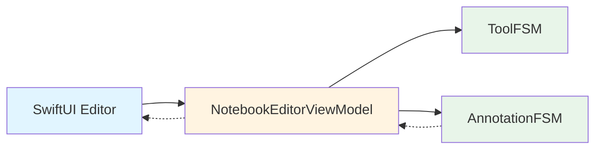
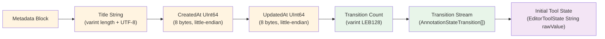
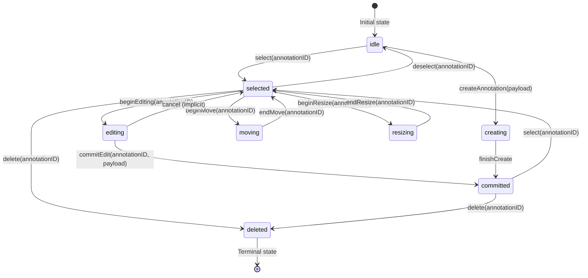
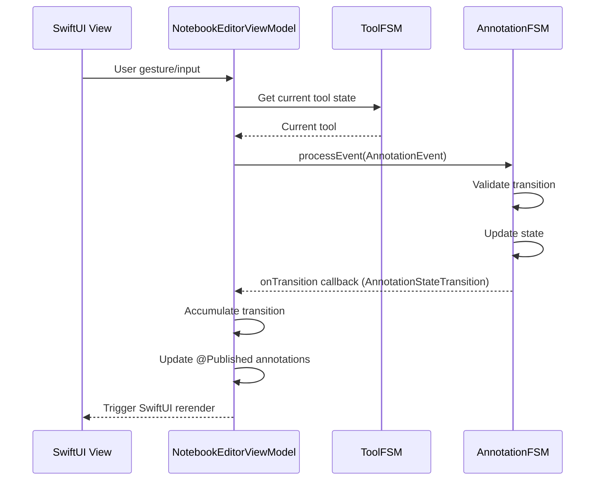

# documentExampleApp  

### Advanced Document Architecture for SwiftUI Editors Using BlazeFSM and BlazeBinary

documentExampleApp demonstrates a modern, deterministic approach to building document-based editors on Apple platforms.  

It integrates event-driven finite state machines, a binary-encoded document format, and a replay-driven annotation model to deliver a scalable foundation for high-performance creative and productivity tools.

This project illustrates architectural patterns suitable for macOS and iOS applications requiring reproducible state, extensible persistence, and predictable rendering behavior.

---

## 1. Introduction

Traditional document editors often persist state directly, resulting in fragile save formats, complex migration paths, and non-deterministic behavior during undo/redo.

documentExampleApp uses a different strategy:

- All annotation and tool interactions emit **state transitions**.  

- Documents store only these transitions using **BlazeBinary**, a strict sequential binary format.  

- On load, the application **replays** the transition log to reconstruct the complete document state.  

- Each annotation is governed by an independent **BlazeFSM** instance to ensure correctness, isolation, and predictability.

This architecture simplifies persistence, enables robust undo/redo semantics, and provides a reliable platform for advanced editing behaviors.

---

## 2. Core Technologies

### BlazeFSM

**Used throughout the application for all state management.**

A minimal, strongly typed finite state machine framework that models:
- **Annotation lifecycles**: Each annotation has its own `AnnotationFSM` instance managing states (idle, creating, selected, editing, moving, resizing, committed, deleted)
- **Tool interactions**: `ToolFSM` manages editor tool state (idle, selection, pen, pencil, highlighter, text, arrow, eraser, lasso)
- **State transitions**: All state changes flow through FSM validation, ensuring correctness and enabling replay-based persistence

**Key Usage:**
- `NotebookEditorViewModel` creates and manages multiple `AnnotationFSM` instances (one per annotation)
- `ToolFSM` coordinates tool selection and switching
- All annotation events (create, select, move, edit, delete) are processed through FSM `processEvent()` methods
- Transition callbacks emit `AnnotationStateTransition` records for persistence

### BlazeBinary

**Used for all serialization and persistence - no Codable or JSON.**

A low-level binary encoding system optimized for deterministic field ordering, forward compatibility, and efficient decoding.

**Key Usage:**
- **Document serialization**: `NotebookFileData`, `NotebookMetadata` conform to `BlazeBinaryCodable`
- **FSM type encoding**: All FSM types (`AnnotationStateTransition`, `AnnotationEvent`, `EditorToolState`, `AnnotationState`, etc.) are encoded/decoded using BlazeBinary
- **Deterministic format**: Field order is strictly preserved, ensuring identical input produces identical binary output
- **No external formats**: The application uses BlazeBinary exclusively - no JSON, no Codable, no PropertyList

**BlazeBinaryCodable Conformance:**
- `NotebookFileData` - root document structure
- `NotebookMetadata` - document metadata
- `AnnotationStateTransition` - state change records
- `AnnotationEvent` - all annotation events
- `EditorToolState` - tool state enum
- `AnnotationState` - annotation state enum
- `AnnotationCreatePayload` - annotation creation data
- `AnnotationEditPayload` - annotation edit data
- `ResizeAnchor`, `ResizeDelta` - resize operation data

### documentExampleApp Document Model

The application persists three primary elements using BlazeBinary:

1. Metadata (title, timestamps) - encoded as `NotebookMetadata`  

2. Transition log (ordered sequence of `AnnotationStateTransition`) - all state changes from BlazeFSM  

3. Initial tool state (`EditorToolState`) - from `ToolFSM`  

These components fully define the document. On load, transitions are replayed through FSM instances to reconstruct state.

---

## 3. High-Level Architecture



**Architecture Flow:**
- Solid arrows indicate direct method calls
- Dotted arrows indicate callback/data flow (AnnotationFSM emits transitions via onTransition callback; ViewModel publishes state changes via @Published properties)

---

## 4. Binary File Format (BlazeBinary Layout)

The file format uses sequential BlazeBinary encoding with no magic header or version field. The format is defined by the encoding order of NotebookFileData fields.



**Format Characteristics**

- **Pure BlazeBinary**: No Codable, no JSON, no PropertyList - all serialization uses BlazeBinary
- **Deterministic sequential encoding**: Metadata → transitions → tool state (field order is strictly preserved)
- **FSM-driven persistence**: All transitions come from BlazeFSM `onTransition` callbacks
- **BlazeBinary primitives**: Arrays use varint count prefix, strings use varint length + UTF-8, integers use little-endian
- **Replay-based restoration**: Transitions are replayed through FSM instances to reconstruct state
- **Forward compatible**: BlazeBinary format supports adding fields without breaking existing documents

---

## 5. Annotation State Machine



Each annotation maintains an independent FSM instance. The state machine validates all transitions and emits transition records for persistence.

---

## 6. Execution Flow



**Flow Notes:**
- ViewModel directly calls AnnotationFSM.processEvent() with events
- AnnotationFSM emits transitions via onTransition callback
- ViewModel accumulates transitions in internal array
- ViewModel updates @Published properties which trigger SwiftUI rerender
- No separate Reducer component - state updates happen directly in ViewModel

---

## 7. Components

**NotebookDocument**

A SwiftUI `FileDocument` implementation responsible for encoding and decoding document state using **BlazeBinary**. Uses `BlazeBinaryNotebookCoder` to serialize/deserialize `NotebookFileData` to/from binary `Data`.

**NotebookEditorViewModel**

Coordinates tool interactions, manages multiple `AnnotationFSM` instances (one per annotation), handles `ToolFSM` for tool state, replays transitions on load, and accumulates new transitions for persistence. All state changes flow through FSM validation.

**BlazeFSM+BlazeBinary Extensions**

Adds `BlazeBinaryCodable` conformance to all BlazeFSM types:
- `EditorToolState` - tool state enum encoding
- `AnnotationState` - annotation state enum encoding  
- `AnnotationEvent` - all event types with payload encoding
- `AnnotationStateTransition` - transition record encoding
- `AnnotationCreatePayload` - creation payload encoding
- `AnnotationEditPayload` - edit payload encoding
- `ResizeAnchor`, `ResizeDelta` - resize operation encoding

External conformance warnings are expected and safe - these are extensions on imported types.

**BlazeBinaryNotebookCoder**

Static encoder/decoder using `BlazeBinaryEncoder` and `BlazeBinaryDecoder` for converting `NotebookFileData` to/from `Data`. Ensures deterministic binary layout.

**NotebookFileData & NotebookMetadata**

Root document structures conforming to `BlazeBinaryCodable`. All fields are encoded sequentially using BlazeBinary primitives (no Codable, no JSON).

---

## 8. Example Integration

```swift

@main

struct documentExampleApp: App {

    var body: some Scene {

        DocumentGroup(newDocument: NotebookDocument()) { file in

            NotebookEditorView(document: file.$document)

        }

    }

}

```

---

## 9. Limitations

- PDF backgrounds not yet integrated

- Undo/redo UI not exposed (engine supports it)

- Minimal hit-testing and selection handles

- Rendering pipeline intentionally simplified

---

## 10. Roadmap

**Near-Term**

- PDFKit integration

- Selection handles and bounds manipulation

- Stroke smoothing

**Mid-Term**

- Full layering model

- BlazeDB indexing

- Multi-page documents

**Long-Term**

- Cross-device sync using transition diffs

- Collaborative editing

---

## 11. License

MIT License.

---

## Summary

documentExampleApp demonstrates how **BlazeFSM** and **BlazeBinary** form the foundation for building reliable, deterministic document editors on Apple platforms.

**Key Architectural Principles:**

- **BlazeFSM everywhere**: All state management flows through FSM instances - annotations, tools, and interactions
- **BlazeBinary for persistence**: All serialization uses BlazeBinary - no Codable, no JSON, no external formats
- **Replay-based restoration**: Documents store transition logs that are replayed through FSM instances on load
- **Deterministic behavior**: Same input always produces same output, enabling reliable undo/redo and state reconstruction
- **Type safety**: Strong typing through FSM state enums and BlazeBinary encoding ensures correctness

The architecture prioritizes correctness, reproducibility, and extensibility, enabling future expansion into sophisticated creative and productivity workflows while maintaining a clean separation between state management (BlazeFSM) and persistence (BlazeBinary).
