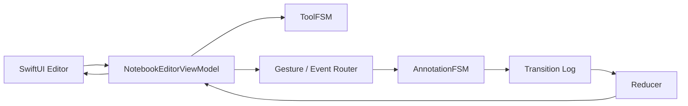
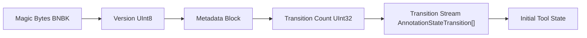
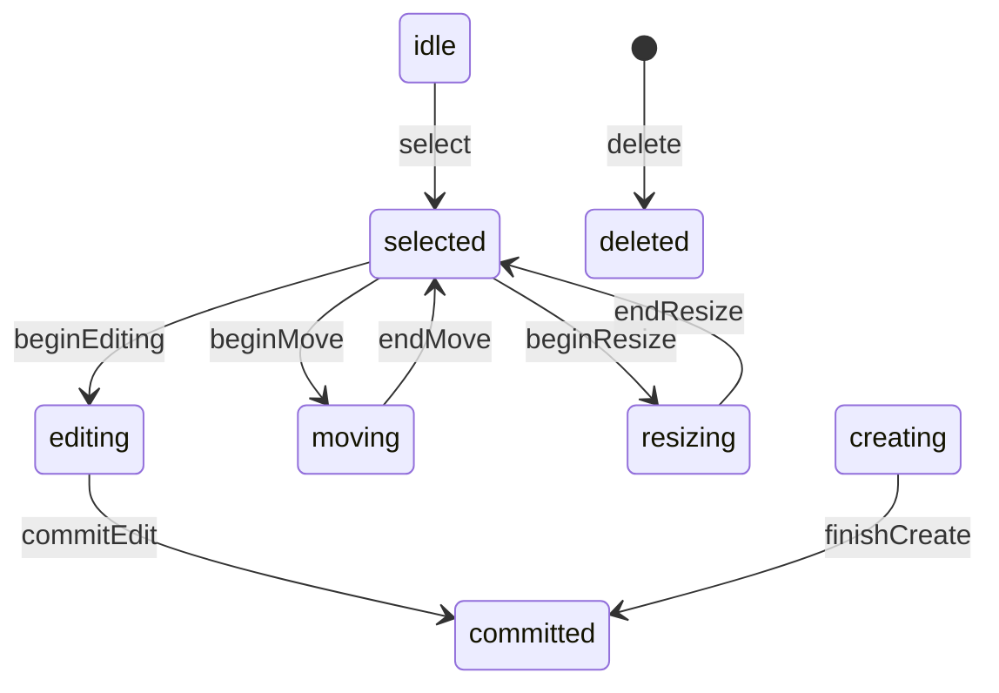
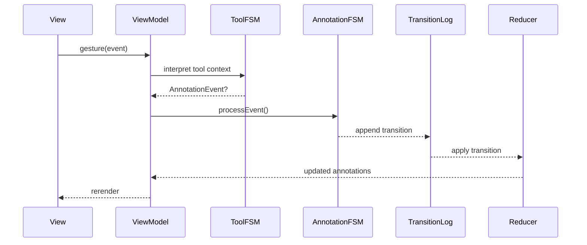

# 📄 documentExampleApp  

### Advanced Document Architecture for SwiftUI Editors Using BlazeFSM and BlazeBinary

documentExampleApp demonstrates a modern, deterministic approach to building document-based editors on Apple platforms.  

It integrates event-driven finite state machines, a binary-encoded document format, and a replay-driven annotation model to deliver a scalable foundation for high-performance creative and productivity tools.

This project illustrates architectural patterns suitable for macOS and iOS applications requiring reproducible state, extensible persistence, and predictable rendering behavior.

---

## 1. Introduction

Traditional document editors often persist state directly, resulting in fragile save formats, complex migration paths, and non-deterministic behavior during undo/redo.

documentExampleApp uses a different strategy:

- All annotation and tool interactions emit **state transitions**.  

- Documents store only these transitions using **BlazeBinary**, a strict sequential binary format.  

- On load, the application **replays** the transition log to reconstruct the complete document state.  

- Each annotation is governed by an independent **BlazeFSM** instance to ensure correctness, isolation, and predictability.

This architecture simplifies persistence, enables robust undo/redo semantics, and provides a reliable platform for advanced editing behaviors.

---

## 2. Core Technologies

### BlazeFSM

A minimal, strongly typed finite state machine framework used to model annotation lifecycles and tool interactions.

### BlazeBinary

A low-level binary encoding system optimized for deterministic field ordering, forward compatibility, and efficient decoding.

### documentExampleApp Document Model

The application persists three primary elements:

1. Metadata (title, timestamps)  

2. Transition log (ordered sequence of AnnotationStateTransition)  

3. Initial tool state  

These components fully define the document.

---

## 3. High-Level Architecture



---

## 4. Binary File Format (BlazeBinary Layout)



**Format Characteristics**

- Deterministic sequential encoding

- No Codable or JSON

- Forward-compatible through versioning

- Efficient replay for restoration

---

## 5. Annotation State Machine



Each annotation maintains an independent FSM instance.

---

## 6. Execution Flow



---

## 7. Components

**NotebookDocument**

A SwiftUI FileDocument implementation responsible for encoding and decoding document state using BlazeBinary.

**NotebookEditorViewModel**

Coordinates tool interactions, annotation FSM instances, transition replay, and rendering updates.

**FSM Extensions**

Adds BlazeBinaryCodable conformance to FSM types.

External conformance warnings are expected and safe.

---

## 8. Example Integration

```swift

@main

struct documentExampleApp: App {

    var body: some Scene {

        DocumentGroup(newDocument: NotebookDocument()) { file in

            NotebookEditorView(document: file.$document)

        }

    }

}

```

---

## 9. Limitations

- PDF backgrounds not yet integrated

- Undo/redo UI not exposed (engine supports it)

- Minimal hit-testing and selection handles

- Rendering pipeline intentionally simplified

---

## 10. Roadmap

**Near-Term**

- PDFKit integration

- Selection handles and bounds manipulation

- Stroke smoothing

**Mid-Term**

- Full layering model

- BlazeDB indexing

- Multi-page documents

**Long-Term**

- Cross-device sync using transition diffs

- Collaborative editing

---

## 11. License

MIT License.

---

## Summary

documentExampleApp demonstrates how deterministic state machines, binary document formats, and declarative UI composition form a reliable foundation for building advanced editors on Apple platforms.

The architectural principles prioritize correctness, reproducibility, and extensibility, enabling future expansion into sophisticated creative and productivity workflows.
