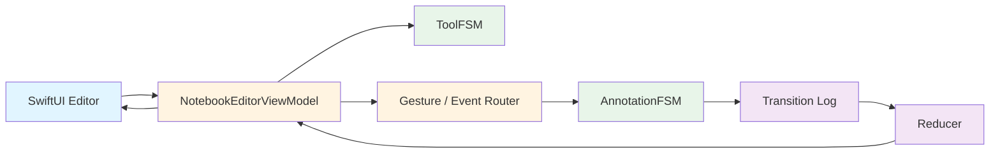
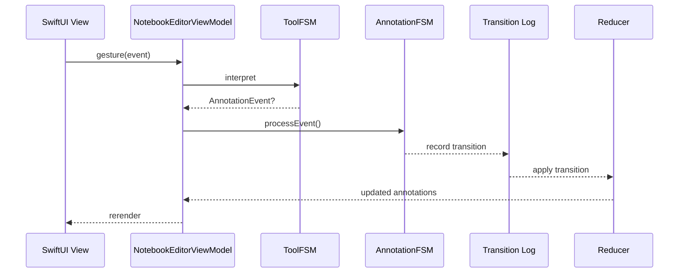

# documentExampleApp

### A Document-Based SwiftUI Editor Powered by BlazeFSM and BlazeBinary

`documentExampleApp` is a macOS and iOS SwiftUI document application that demonstrates a production-quality document editor architecture. The app showcases BlazeFSM for event-driven finite state machines, BlazeBinary for deterministic binary document serialization, and a replay-based annotation system with comprehensive tool support and state transition management.

## Features

- **Document-Based SwiftUI App**: Native DocumentGroup integration with autosave, multi-window support, and system file coordination
- **Annotation System**: Complete annotation lifecycle management with create, move, resize, edit, and delete operations
- **Tool System**: Comprehensive tool palette including pen, pencil, highlighter, text, arrow, selection, eraser, and lasso tools
- **Replay-Driven State Management**: Transition log architecture enabling undo/redo capabilities and state reconstruction
- **BlazeBinary File Format**: Deterministic binary serialization with `.bnbk` file extension for efficient, reproducible document storage

## High-Level Architecture

The application architecture follows an event-driven pipeline where user interactions flow through state machines, generate transition records, and drive reactive UI updates.



**Architecture Components:**
- **SwiftUI Editor**: Reactive view layer that responds to published state changes
- **NotebookEditorViewModel**: Central coordinator managing tool and annotation state machines
- **ToolFSM**: Ephemeral state machine managing current tool selection
- **Event Router**: Converts user gestures into annotation events
- **AnnotationFSM**: Validates and processes annotation state transitions
- **Transition Log**: Accumulates all state transitions for persistence and replay
- **Reducer**: Applies transitions to update annotation models

## Binary File Format (BlazeBinary Layout)

The notebook document format uses deterministic sequential encoding with strict field ordering. All encoding uses BlazeBinary; no Codable or JSON is used. Encoding is deterministic and sequential.

```mermaid
flowchart LR
    A["Magic Bytes<br/>'BNBK'<br/>(4 bytes)"] --> B["Version<br/>UInt8<br/>(1 byte)"]
    B --> C["Metadata Block"]
    C --> D["Title<br/>String<br/>(varint length + UTF-8)"]
    D --> E["CreatedAt<br/>UInt64<br/>(8 bytes, epoch seconds)"]
    E --> F["UpdatedAt<br/>UInt64<br/>(8 bytes, epoch seconds)"]
    F --> G["Transition Count<br/>Varint<br/>(LEB128)"]
    G --> H["Transition Stream<br/>AnnotationStateTransition[]"]
    H --> I["Initial Tool State<br/>EditorToolState<br/>(String rawValue)"]
    
    style A fill:#e1f5ff
    style B fill:#e1f5ff
    style C fill:#fff4e1
    style D fill:#fff4e1
    style E fill:#fff4e1
    style F fill:#fff4e1
    style G fill:#e8f5e9
    style H fill:#e8f5e9
    style I fill:#f3e5f5
```



**Format Characteristics:**
- All encoding uses BlazeBinary deterministic serialization
- No Codable or JSON is used anywhere in the file format
- Encoding is deterministic and sequential (strict field order)
- Cross-platform stability via little-endian integers and UTF-8 strings

## Annotation State Machine

The annotation lifecycle is governed by a finite state machine that ensures valid state transitions and prevents invalid annotation operations. Each annotation has its own AnnotationFSM instance, and the app layer manages multiple FSMs via an annotation manager.


**State Transition Rules:**
- **idle**: Initial state with no active annotation
- **selected**: Annotation is selected and ready for operations
- **editing**: Annotation content is being modified
- **moving**: Annotation position is being changed
- **resizing**: Annotation dimensions are being adjusted
- **creating**: New annotation is being created
- **committed**: Annotation is finalized and persisted
- **deleted**: Annotation is marked for removal (terminal state)

## Data Flow

The editor follows an event-driven data flow where user gestures are interpreted, converted to events, processed through state machines, and result in state updates that drive UI rerendering.



**Flow Characteristics:**
- **Event-Driven**: All user interactions flow through state machines as events
- **Transition Logging**: Every state change is recorded for persistence and undo/redo
- **Reactive Updates**: SwiftUI automatically rerenders when published state changes
- **Separation of Concerns**: Tool selection (ephemeral) is separate from annotation state (persistent)

## Components

### NotebookDocument

The `NotebookDocument` struct conforms to SwiftUI's `FileDocument` protocol and uses BlazeBinary for load/save operations. It stores:
- **Metadata**: Document title, creation timestamp, last modification timestamp
- **Transitions**: Complete array of `AnnotationStateTransition` records
- **Tool State**: Initial `EditorToolState` for restoration

The document format is deterministic and uses sequential BlazeBinary encoding with no Codable or JSON dependencies.

### NotebookEditorViewModel

The `NotebookEditorViewModel` is the central coordinator that:
- Owns `ToolFSM` for ephemeral tool state management
- Manages per-annotation `AnnotationFSM` instances via an annotation manager
- Publishes annotation models as `@Published` properties for SwiftUI binding
- Accumulates transitions during editing sessions
- Replays transitions on document load to reconstruct annotation states

### BlazeFSM + BlazeBinary Extensions

`AnnotationStateTransition` and `EditorToolState` conform to `BlazeBinaryCodable` via extensions in `BlazeFSM+BlazeBinary.swift`. These extensions add BlazeBinary serialization support to imported BlazeFSM types.

**Note**: Swift compiler warnings about extending imported types with protocol conformances are expected and safe. These warnings inform us that if BlazeFSM adds native BlazeBinaryCodable support in the future, we should remove these extensions to avoid conflicts.

## Example Usage

A minimal SwiftUI example demonstrating documentExampleApp integration:

```swift
@main
struct documentExampleApp: App {
    var body: some Scene {
        DocumentGroup(newDocument: NotebookDocument()) { file in
            NotebookEditorView(document: file.$document)
        }
    }
}
```

The `NotebookEditorView` binds to the document and uses `NotebookEditorViewModel` to manage annotation state and tool selection. The view model automatically handles transition logging and state persistence.

## Limitations

Current implementation limitations:

- **PDF Rendering**: PDF rendering not yet integrated (annotations over a blank canvas only)
- **Undo/Redo UI**: Undo/redo UI not wired, although the transition log engine supports it
- **Rendering Pipeline**: Rendering pipeline (hit-testing, handles, smoothing) is minimal
- **Multi-Annotation Management**: Multi-annotation management exists at the engine level but is only partially wired into the UI

## Roadmap

Planned enhancements:

- **PDFKit Integration**: PDFKit integration as document background
- **Rich Selection/Transform Handles**: Visual selection and transformation handles for annotations
- **Stroke Smoothing and Layering**: Advanced rendering with stroke smoothing and layer management
- **BlazeDB Integration**: Optional BlazeDB integration for indexing and search capabilities
- **Undo/Redo UI**: Complete undo/redo user interface implementation
- **Multi-Window Coordination**: Enhanced multi-window document coordination

## Development

### Requirements
- macOS 15.7+ or iOS 15.7+
- Xcode 15.0+
- Swift 5.0+
- BlazeBinary package dependency
- BlazeFSM package dependency

### Building

```bash
# Open in Xcode
open DocumentApp.xcodeproj

# Or build from command line
xcodebuild -project DocumentApp.xcodeproj -scheme DocumentApp -destination 'platform=macOS' build
```

### Project Structure

```
DocumentApp/
├── NotebookDocument/
│   ├── NotebookMetadata.swift          # Document metadata structure
│   ├── NotebookFileData.swift          # Complete file format
│   ├── BlazeBinaryNotebookCoder.swift  # Encoding/decoding utilities
│   ├── NotebookDocument.swift           # FileDocument implementation
│   ├── NotebookEditorViewModel.swift    # State management view model
│   ├── NotebookEditorView.swift        # Editor UI
│   ├── BlazeFSM+BlazeBinary.swift      # Protocol conformance extensions
│   └── UTType+NotebookDocument.swift    # File type registration
├── ContentView.swift                    # Main application view
└── DocumentAppApp.swift                 # Application entry point
```

## License

Copyright (c) 2025 Danylchuk Studios LLC. All rights reserved.

## Acknowledgments

Built using:
- **BlazeBinary**: Deterministic binary serialization framework
- **BlazeFSM**: Event-driven finite state machine framework
- **SwiftUI**: Native UI framework
- **UniformTypeIdentifiers**: File type system integration
